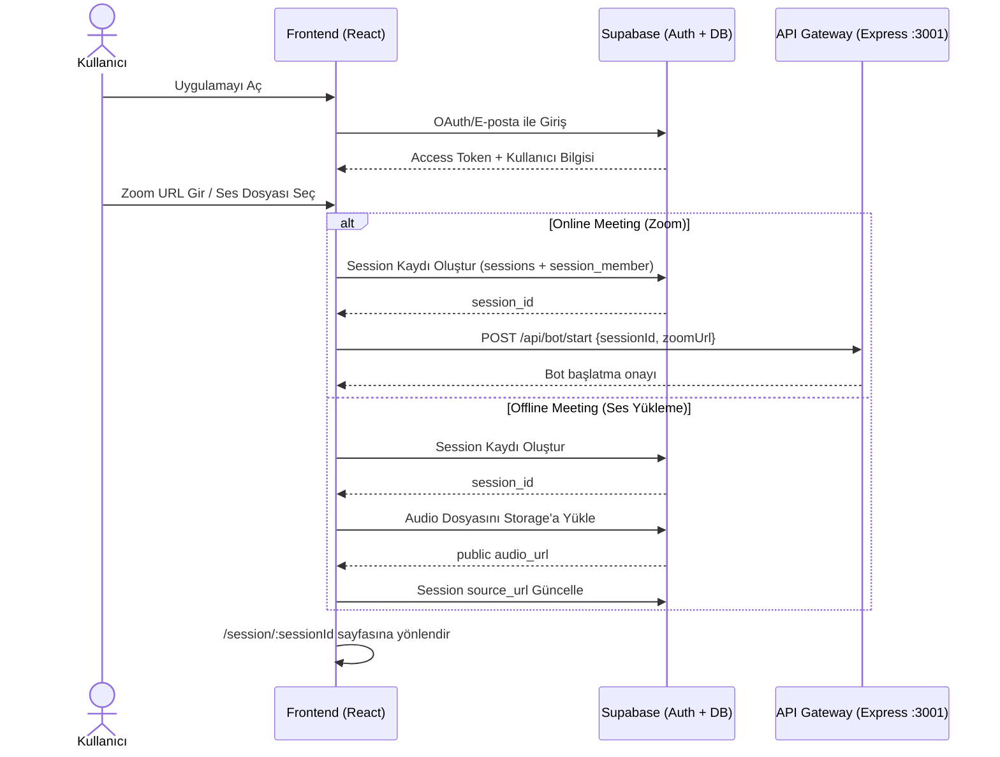
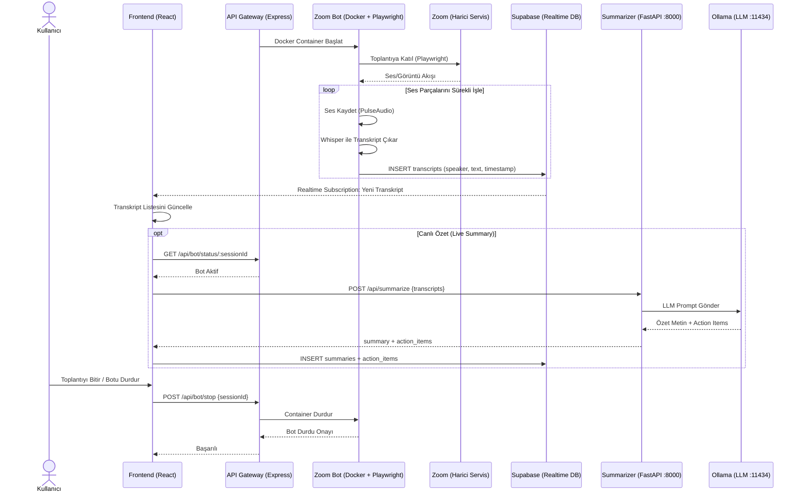
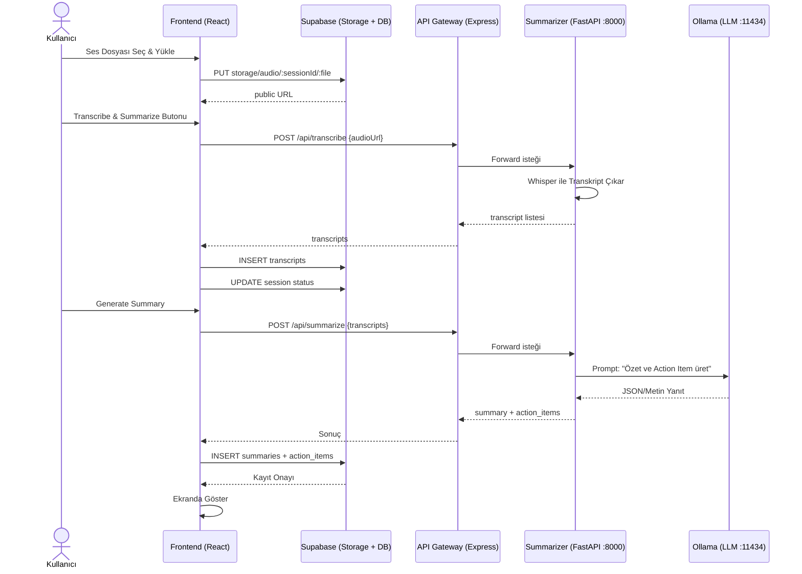
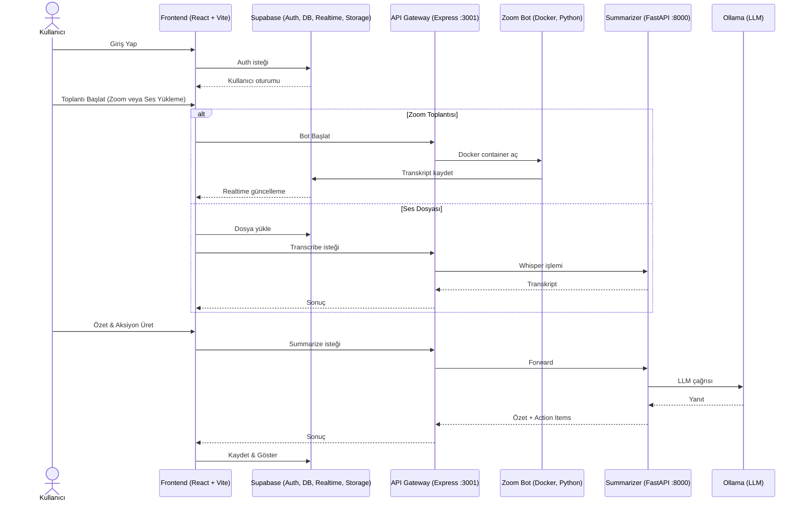

# Ata Meeting Assistant — Akış Şemaları

Bu dokümanda uygulamanın temel sequence diyagramları yer almaktadır.

---

## 1. Kimlik Doğrulama & Session Oluşturma Akışı

---

## 2. Zoom Bot ile Canlı Toplantı Akışı

---

## 3. Ses Yükleme, Transkripsiyon ve Özetleme Akışı

---

## 4. Genel Mimari Özet (Basitleştirilmiş Tek Diyagram)

